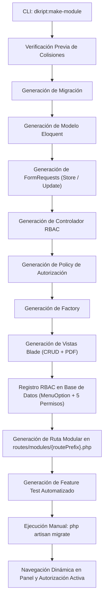

# 🏛️ Arquitectura del Sistema — Dkript Core

**Versión del Core:** `0.1.0-dev`  
**Gobernanza:** Dkript Inc.  

---

## 1. Principios Fundacionales de Arquitectura

Dkript Core es una base de arquitectura empresarial reutilizable construida sobre Laravel 13, diseñada bajo estrictos principios de gobernanza, desacoplamiento y mantenibilidad:

1. **Inviolabilidad de Código Aprobado:** La funcionalidad base del núcleo es inmutable; las nuevas capacidades de negocio se agregan mediante módulos independientes sin alterar las rutas troncales ni los controladores base.
2. **Matriz RBAC Granular de 5 Posiciones:** Todo recurso o módulo del sistema está sujeto a 5 posiciones atómicas de autorización:
   - Posición 1: **Crear** (altas, duplicación y guardado).
   - Posición 2: **Editar** (modificación y actualización).
   - Posición 3: **Eliminar** (borrado físico o lógico).
   - Posición 4: **Ver / PDF** (lectura de detalles y exportación documental).
   - Posición 5: **Especial / Excel** (acciones avanzadas de gestión y exportación en hoja de cálculo).
3. **Enrutamiento Modular Desacoplado:** `routes/web.php` está reservado exclusivamente para los flujos troncales del Core. Todo módulo adicional se registra en `routes/modules/{routePrefix}.php` y es cargado dinámicamente en el arranque.
4. **Precedencia de Configuración:** `Parameter` (tabla `parameters`) es la fuente de verdad primaria para ajustes funcionales, con fallbacks jerárquicos a presets y valores neutros del Core.
5. **Auditoría Transversal con Redacción Automática:** `AuditService` captura eventos de auditoría administrativa y de autenticación, redactando automáticamente contraseñas, tokens y claves de acceso.

---

## 2. Mapa de Servicios Troncales del Core

La capa de servicios (`app/Services/`) encapsula la lógica de negocio reusable del Core:

| Servicio | Responsabilidad Primaria | Interacción con Base de Datos / Configuración |
|---|---|---|
| **`AuditService`** | Registro estructurado de eventos en `audit_logs` y Log de Laravel, con sanitización y redacción automática de secretos (`[REDACTED]`). | Escribe en tabla `audit_logs`. |
| **`BrandingService`** | Resolución dinámica de nombre, logotipo, favicons, escenas de error y textos institucionales bajo el modelo de 3 niveles. | Consume `Parameter` (BD) $\rightarrow$ `config('dkript.*')` $\rightarrow$ Neutral Core. |
| **`BackupService`** | Generación de respaldos de base de datos (`.sql` / `.sql.gz`) y medios (`.zip`), retención automática, purga y restauración segura con *Safety Backup* y *Restore Lock*. | Interactúa con el motor MySQL/SQLite y el almacenamiento en `storage/app/backups`. |
| **`MailConfigService`** | Reconfiguración dinámica del transporte SMTP de Laravel en tiempo de ejecución antes de emitir correos. | Lee credenciales cifradas en `parameters`. |
| **`MessagingService`** | Servicio de mensajería multicanal (SMS / WhatsApp) con arquitectura de drivers (*LogSimulator*, *Twilio*, *WhatsAppCloud*). | Lee proveedor activo y tokens cifrados en `parameters`. |
| **`NotificationService`** | Gestión centralizada de notificaciones in-app persistentes en la barra superior. | Lee y escribe en tabla `notifications`. |
| **`TwoFactorAuthService`** | Autenticación de Dos Factores mediante TOTP (RFC 6238) y generación de códigos de recuperación de emergencia. | Almacena secrets cifrados y recovery codes en tabla `users`. |
| **`DeviceDetectorService`** | Detección de dispositivos, navegadores y plataformas a partir del User-Agent para gestión de sesiones activas. | Consume datos de `sessions` y solicitudes HTTP. |
| **`ExportService`** | Exportación tabular limpia a hojas de cálculo Excel y documentos PDF vía Dompdf. | Renderiza plantillas Blade optimizadas sin JavaScript dependiente. |

---

## 3. Ciclo de Vida Conceptual de un Módulo de Negocio

Cuando se desarrolla un nuevo módulo mediante las herramientas del Core, su integración sigue el siguiente flujo arquitectónico ordenado:



---

## 4. Pipeline de Enrutamiento Modular (`bootstrap/app.php`)

Dkript Core utiliza la arquitectura de arranque de Laravel 13 configurada en `bootstrap/app.php`. El cargador dinámico escanea de forma aislada y determinista el directorio `routes/modules/`:

```php
->withRouting(
    web: __DIR__.'/../routes/web.php',
    commands: __DIR__.'/../routes/console.php',
    health: '/up',
    then: function () {
        $modulesPath = base_path('routes/modules');
        if (is_dir($modulesPath)) {
            $routeFiles = glob($modulesPath . '/*.php') ?: [];
            sort($routeFiles);
            foreach ($routeFiles as $routeFile) {
                Route::middleware('web')->group($routeFile);
            }
        }
    },
)
```

### Ventajas de este Diseño
1. **Inmutabilidad de `routes/web.php`:** El archivo central nunca es modificado por herramientas automáticas o generadores de código.
2. **Carga Modular de Rutas:** La definición de endpoints de negocio reside de forma aislada en su respectivo archivo dentro de `routes/modules/`.
3. **Compatibilidad con Caché de Rutas:** La arquitectura modular actual ha sido validada con `php artisan route:cache`.